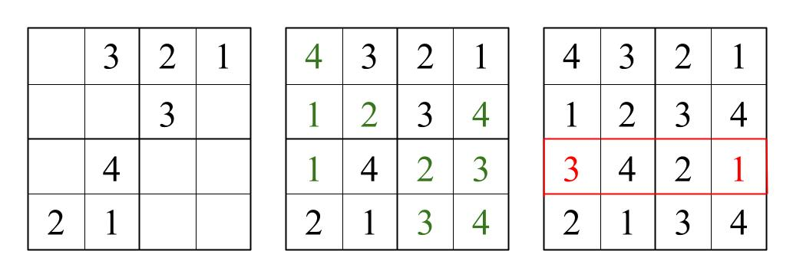
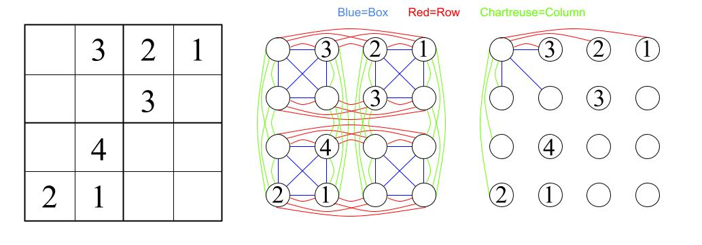
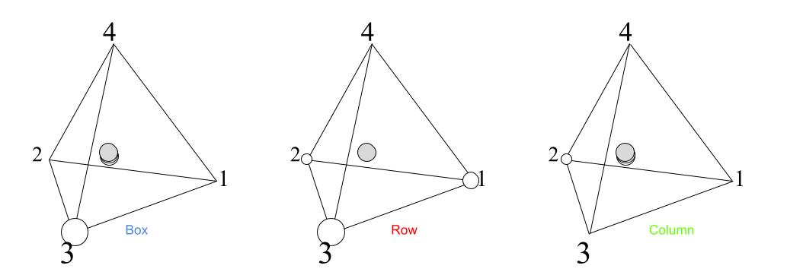

# Solvers

This directory contains all of the sudoku-solving algorithms implemented in the library. In this README are descriptions and comparisons of the algorithms.

# Algorithms
## Basic Searches

**Depth-First Search**

Depth-First Search is based on the premise of treating the sudoku state space as a searchable tree graph. For more information on searching tree graphs and depth-first search, [this hackerearth article](https://www.hackerearth.com/practice/algorithms/graphs/depth-first-search/tutorial/) is a good starting point.

Here, the state space is the space of all possible configurations of values in the grid - whether or not they are valid sudoku solutions. We define the state space graph as such:

> A sudoku state *S* is the child of another sudoku state *T* if and only if *S* can be obtained from *T* by selecting an empty cell of *T* and assigning a value to it. This value does not have to be correct.

For example, the following image shows two incomplete 4x4 sudokus. The sudoku on the right is obtained by setting the upperleftmost value to 3. Thus, in the 4x4 sudoku state space, the sudoku state on the right is a child of the state on the left - despite the eggregious error.

After a child state is selected (i.e., a guess is applied to the sudoku) it is evaluated to see if there are any constraint violations. If so, all children of this state will also contain that violation. Thus, the search can now prune the entire branch of sudoku states, backtrack to the last valid state, and continue the search. This process continues until a sudoku state in which all values are filled in with no constraint violations is found.

**Depth-First Search V1**

After implementing this algorithm, it was rewritten with several optimizations including pointer iteration, and rearranged logic. The original implementation was left in the code to be used for benchmarking other algorithms.

## Simulated Annealing

This algorithm was implemented according to *Matahueristics can solve sudoku puzzles* [[1]](#references). 

Simulated annealing is a [metaheuristic](https://en.wikipedia.org/wiki/Metaheuristic "Wikipedia") which borrows from metallurgy concepts. For a great visual introduction to the idea of annealing, check out [Steve Mould's YouTube video](https://www.youtube.com/watch?v=xuL2yT-B2TM) *(8min)*.

In the video, Steve Mould demonstrates annealing using metallic balls which are settling due to gravity. The implementation of simulated annealing in the context of Sudoku is more analagous to a situation in which only one of those balls is animated while the rest are static, and the animated ball is searching for the lowest dimple in the terrain.

To implement the algorithm, a cost function has to be defined which acts as a measurement of the "height" of the ball. The optimal resting place for the ball is the location in which it has the lowest height.

In the Sudoku context, a good measurement of "height" is the number of constraint violations (i.e., the number of cells which share the same value as a neighbor).

After defining a cost (height) function. A temperature schedule needs to be defined. The higher the temperature, the more kinetic energy the ball has, and the more likely it is to bounce out of a local minimum. The lower the temperature, the less kinetic energy the ball has, and the less likely the ball is to bounce out of a local minimum. By progressively cooling the temperature, the ball is more likely to find itself in the global minimum of the terrain.

A number of temperature schedules were defined in a 1987 book titled *Simulated Annealing: Theory and Applications* [[2]](#references) for simulated annealing. A few are shown below where `t` represents the temperature.

| Schedule | Initialize | Update | Notes |
| --- | --- | --- | --- |
| <code>Geometric(t0, a)</code> | <code>t = t0</code>| `t = a * t` | <code>a∈(0,1); t0>0</code> |

Finally, a function `P(t, Δ)` which describes the acceptance probability must be defined. This function `P` depends on the temperature `t` and the change in height `Δ`. Note the dependence on the *change* in height. This allows the simulated annealing algorithm to make decisions locally - which is especially useful in contexts where the value of the global minimum is not known. The popularity vote for acceptance probability functions - and the choice for this algorithm - goes to the exponential function:

    P(t, Δ) = exp(-Δ / t)

It is also often encouraged to sample a *series* of random state changes (as in a [markov chain](https://en.wikipedia.org//wiki/Markov_chain)) in between temperature updates. This is the approach taken in *Metaheuristics can solve sudoku puzzles* [[1]](#references), suggested in *Simulated Annealing: Theory and Applications* [[2]](#references), and implemented here. As recommended in *Metaheuristics can solve sudoku puzzles* [[1]](#references) the length of this chain is equal to the square of the number of empty cells in the provided puzzle.

Before applying these decisions to the partially-filled Sudoku, the empty values must be initialized. To reduce the search space of the sudoku, each puzzle can be initialized so that every row contains one of every value. Thus, constraint violations only occur in the boxes and columns, and the random state changes can be limited to swapping two cells in the same row. Take the following image as an example.

The leftmost sudoku is the original puzzle. First, the algorithm fills each row with the missing values. Then, simulated annealing begins by randomly selecting a row, then selecting two cells within that row that were initially empty, and swapping them according to the acceptance probability and cooling schedule defined prior. 

In the event that the system gets sufficiently "cool" and the puzzle is still not solved, the algorithm "reheats" (reinitializes) and repeats.

## Collapsing Graph

### The Concept

In this approach, the Sudoku graph is not the state space graph as defined above in [depth first search](#basic-searches). Here, the Sudoku graph is an undirected graph `G(V, E)` with vertices `V` and edges `E` defined as such:

> The set of vertices `v∈V` is the set of all cells in the Sudoku puzzle
> 
> The set of edges <code>e(v1,v2,n)∈E</code> is the set of all cell pairs <code>v1,v2∈V</code> which share a neighborhood `n` (e.g., row, column, or box).

Parameterizing the edges by neighborhood type allows for a separation of constraints - the utility of which will become more apparent later on. For now, it is simply important to note that

<ol>
    <li>a cell <code>v1</code> which shares two neighborhoods (e.g., row and box) with another cell <code>v2</code> will now have this information represented by two edges <code>er(v1,v2,r)</code> and <code>eb(v1,v2,b)</code> in the graph <code>G</code>; and</li>
    <li>the graph <code>G(V,E)</code> can be described as the union of many subgraphs <code>Gi(Vi,Ei)</code> which each represent a single neighborhood and where the following properties hold: 
        <ul>
        <li>the full graph edge set <code>E</code> is partitioned by the set of all subgraph edge sets <code>Ei</code></li>
        <li>each subgraph <code>Gi</code> is fully connected (i.e., any two distinct vertices in the subgraph are connected)</li>
        </ul>  
    </li>
</ol>

To illustrate the concept of the collapsing algorithm, the following 4x4 sudoku will be explored.

The middle figure showcases the full structure of the 4x4 Sudoku in graph form. On the right, only the edges connecting the first vertex are shown. 

The premise behind the collapsing graph approach, is that each neighborhood exists on its own [simplex](https://en.wikipedia.org/wiki/Simplex). In the case of the 4x4 sudoku, this will be the 3-simplex (i.e., the simplex existing in 3 dimensions). Due to the double meaning of vertex the following vocabulary will be used: a vertex of the simplex will be referred to as a "point", whereas a vertex of the Sudoku graph will be referred to as a "node".

Each point of the simplex represents one of the legal values in the Sudoku puzzle (1, 2, 3, or 4 in this case). Each node is attracted to the points of the simplex, but repelled by the other nodes withinin the same simplex structure. As information propagates through these simplex systems, nodes will bind themselves to one point (and thus one value) of the simplex, hence the name "collapsing graph".

The physical coordinates of each node in the simplex are represented using [barycentric coordinates](https://en.wikipedia.org/wiki/Barycentric_coordinate_system), and it's important that each node have only one set of coordinates. For example, a node cannot be a two in one of its row's simplex and a three in its column's simplex. Each node is initialized at the barycenter of the simplex, which is the barycentric coordinates `<0.25, 0.25, 0.25, 0.25>` in the 3-simplex.

To illustrate this concept, the following figure shows the three simplex systems in which the first vertex (shown in grey) exists.

### The Implementation

#### Simplex Constraints

For barycentric coordinates <code>\<α1, α2, ..., αn\></code> to remain in the simplex, they must satisfy two constraints.

1. The sum over all coordinate values must equal one (<code>Σi=1n[αi] = 1</code>), and
2. all coordinate values must be positive real numbers (<code>∀i∈{1 ... n}; αi≥0</code>)

For coherence, the first constraint will be reffered to as the affine constraint since it constrains the coordinates to the affine space which contains the simplex. The second constraint will be referred to simply as the nonnegative constraint.

#### Update Step

During the update step, it is important that each node receive information from all of its neighbors. Further, the weight of each neighbor should be proportional to some measure of confidence in that neighbor's current value. A convenient measure of that confidence - which will also aid in satisfying the affine constraint - is the displacement vector from each node to the barycenter `C`. When adding this displacement vector to any vector lying in the affine space, the resultant vector will also lie in the affine space. 

Each node can then be adjusted by adding the average over all of its neighborhood update vectors.

#### Reconstrain Step

While the update vector will maintain the affine constraint, it is not guaranteed to maintain the nonnegative constraint. There are many ways to reconstrain to the simplex from within the affine space. It is important to reconstrain in a manner that is consistent with the metaphor of the node running into simplex walls and sliding along them. Thus, the following procedure is used:

    constraining ← true
    while constraining:
    > constraining ← false
    > sum ← -1
    > count ← 0
    > for α in coordinates:
    > > if α > 0: 
    > > > sum ← sum + α
    > > > count ← count + 1
    > > else: 
    > > > α ← 0
    > update ← sum / count
    > for α in coordinates:
    > > if α > 0:
    > > > α ← α - update
    > > if α < 0:
    > > > constraining ← true

## Algorithm Comparison
-----------------

## References

**[1]** Rhyd Lewis. “Metaheuristics can solve sudoku puzzles”. In: Journal of Heuristics 13.4 (2007), pp. 387–401. doi: [10.1007/s10732-007-9012-8](doi.org/10.1007/s10732-007-9012-8).

**[2]** Laarhoven, et.al. "Simulated Annealing: Theory and Applications", 1987, Volume 37 ISBN : 978-90-481-8438-5.