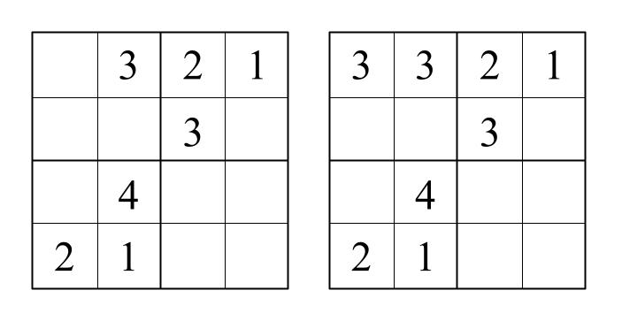

# Solvers

This directory contains all of the sudoku-solving algorithms implemented in the library. In this README is descriptions and comparisons of the algorithms.

## Algorithms
----------------
## Basic Searches

**Depth-First Search**

Depth-First Search is based on the premise of treating the sudoku state space as a searchable tree graph. For more information on searching tree graphs and depth-first search, [this hackerearth article](https://www.hackerearth.com/practice/algorithms/graphs/depth-first-search/tutorial/) is a good starting point.

Here, the state space is the space of all possible configurations of values in the grid - whether or not they are valid sudoku solutions. We define the state space graph as such:

    A sudoku state *S* is the child of another sudoku state *T* if and only if *S* can be obtained from *T* by selecting an empty cell of *T* and assigning a value to it. This value does not have to be correct.

For example, the following image shows two incomplete 4x4 sudokus. The sudoku on the right is obtained by setting the upperleftmost value to 3. Thus, in the 4x4 sudoku state space, the sudoku state on the right is a child of the state on the left.

After a child state is selected (i.e., a guess is applied to the sudoku) it is evaluated to see if there are any constraint violations. If so, all children of this state will also contain that violation. Thus, the search can now prune the entire branch of sudoku states, backtrack to the last valid state, and continue the search. This process continues until a sudoku state in which all values are filled in with no constraint violations is found.

**Depth-First Search V1**

After implementing this algorithm, it was rewritten with several optimizations including pointer iteration, and rearranged logic. The original implementation was left in the code to be used for benchmarking other algorithms.

## Simulated Annealing

This algorithm was implemented according to [\[1\]](). 

Simulated annealing is a metaheuristic 

| Schedule | Equation |
| --- | --- |
| Geometric | t = a * t |

## Collapsing Graph

To build a thorough understanding of the collapsing graph solution to the Sudoku puzzle, we will begin by defining the Sudoku as a graph. While this is relatively straightforward for those familiar with Computer Science concepts and/or mathematics, it is important to stress that the definition of the graph here

We use the barycentric coordinate system. Why? Becuase I have a hunch that plain coordinates just aren't good enough.

### Evolutionary Approaches

### Population-Based Approaches

## Algorithm Comparison
-----------------

## References
**\[1\]** Rhyd Lewis. “Metaheuristics can solve sudoku puzzles”. In: Journal of Heuristics 13.4 (2007), pp. 387–401. doi: [10.1007/s10732-007-9012-8](doi.org/10.1007/s10732-007-9012-8).